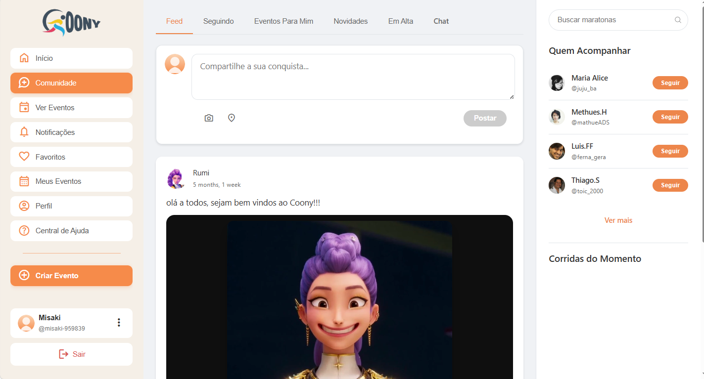
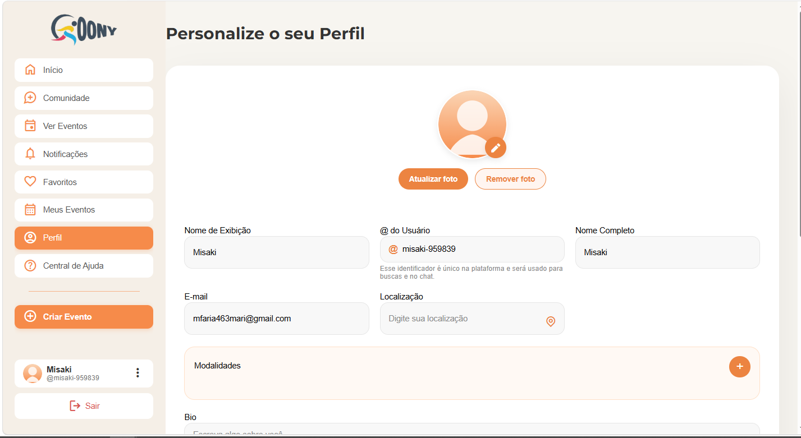
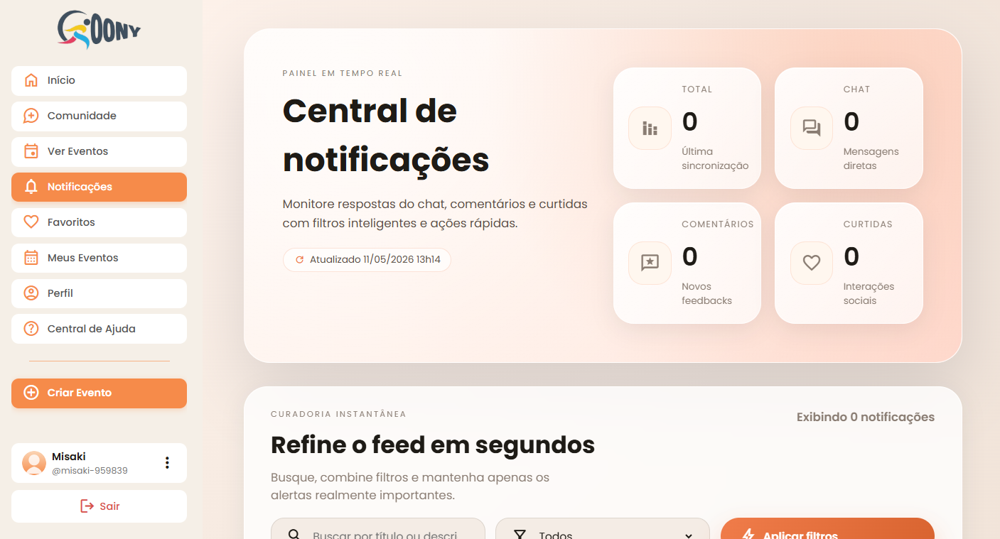

# Coony - Plataforma Social Esportiva

Uma plataforma social desenvolvida com Django voltada para interação entre usuários, criação de eventos, networking esportivo, chat privado e engajamento em comunidade.

O projeto foi desenvolvido colaborativamente durante o programa Transforme-se/Senac, com foco em experiência do usuário, interface moderna e funcionalidades sociais completas.

---

##  Visão Geral

O Coony foi criado com o objetivo de conectar pessoas através do esporte e da comunidade, oferecendo recursos sociais semelhantes aos de plataformas modernas, mas adaptados para interação esportiva, eventos e networking.

A plataforma conta com:
- sistema de usuários
- feed social
- comentários e curtidas
- criação de eventos
- favoritos
- notificações
- chat privado
- perfis personalizáveis
- layouts responsivos

---

## Funcionalidades

###  Sistema de Usuários
- Cadastro e login
- Username personalizado
- Sessão autenticada
- Perfil editável
- Upload de foto de perfil
- Bio e localização

---

### Feed Social
- Publicação de posts
- Upload de imagens
- Curtidas
- Comentários
- Feed dinâmico
- Sugestão de usuários

---

### Sistema de Eventos
- Criação de eventos
- Dashboard de eventos
- Favoritar eventos
- Cards responsivos
- Organização visual das informações

---

### Chat Privado
- Conversas entre usuários
- Busca de usuários
- Sistema de mensagens
- Estrutura preparada para tempo real

---

### Notificações
- Sistema de notificações
- Curtidas
- Comentários
- Feedback visual
- Sistema de Toasts customizado

---

### Responsividade
O projeto possui:
- versão desktop
- versão mobile
- componentes adaptativos
- navegação dinâmica

---

# Screenshots

## Comunidade



---

## Perfil



---

## Notificações



---

# Tecnologias

## Front-end
- HTML5
- CSS3
- JavaScript

## Back-end
- Python
- Django 5

## Banco de Dados
- SQLite

## Bibliotecas & Ferramentas
- Pillow
- django-user-agents
- CropperJS
- Google Fonts
- Material Symbols
- Boxicons

---

# Estrutura do Projeto

```txt
coony/
│
├── coony/
├── usuarios/
│   ├── templates/
│   ├── static/
│   ├── migrations/
│   ├── models.py
│   ├── views.py
│   ├── forms.py
│   └── urls.py
│
├── media/
├── requirements.txt
├── manage.py
└── README.md
```

---

# Projeto em Equipe

Projeto desenvolvido em equipe durante o programa Transforme-se/Senac.

## Minha participação
- Desenvolvimento front-end
- Criação de interfaces
- Protótipos de telas
- Estrutura visual
- Apoio no back-end com Django

---

# Como Executar

## Instale as dependências

```bash
py -m pip install -r requirements.txt
```

---

## Execute o servidor

```bash
py manage.py runserver
```

---

## Acesse no navegador

```txt
http://127.0.0.1:8000/
```

---


#  Melhorias Futuras

- API REST
- PostgreSQL
- WebSockets
- Sistema avançado de notificações
- Melhorias de performance
- Deploy completo em produção

---

# Documentação Técnica

A documentação técnica completa está disponível em:

```txt
DOCUMENTATION.md
```

---

# Licença

MIT License